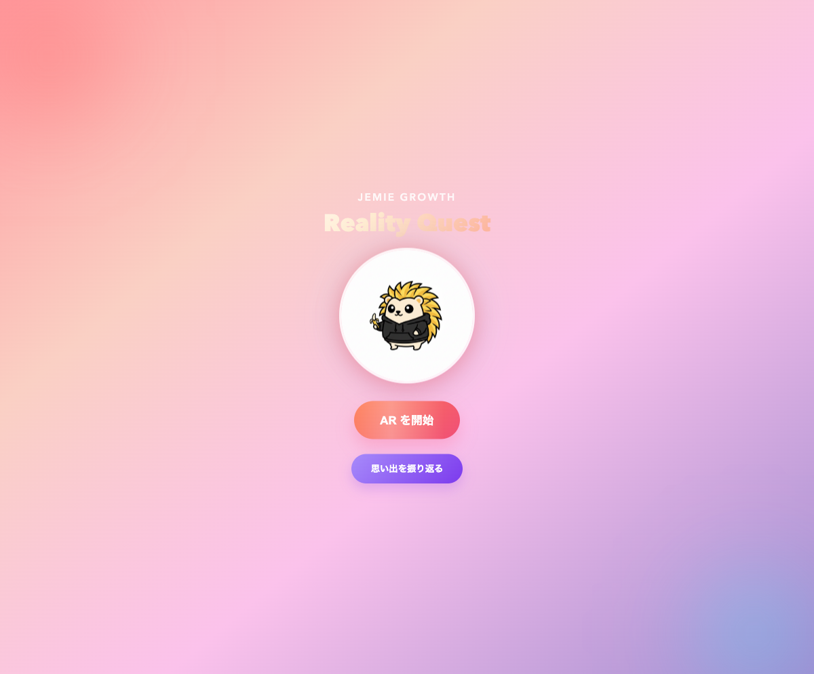
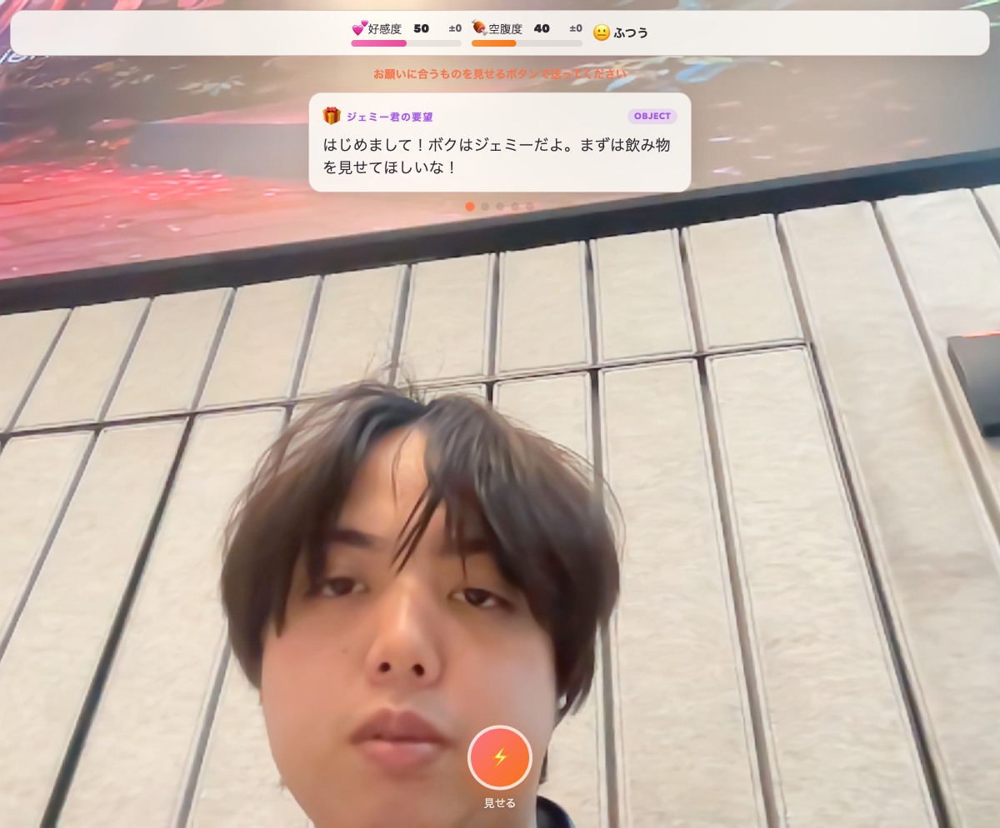
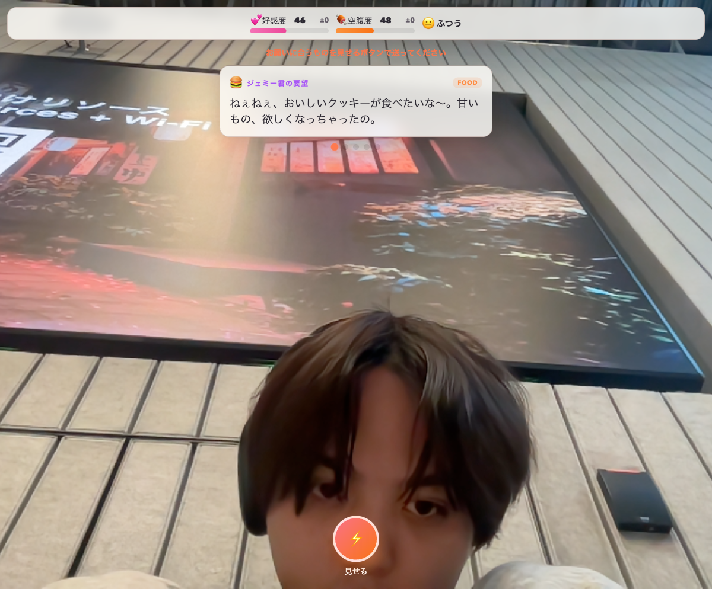

# Gemie — Reality Quest

<p align="center">
  
</p>

<p align="center">
  <strong>AR + Gemini API で現実世界をゲーム化する、AI キャラクター育成アドベンチャー</strong>
</p>

<p align="center">
  Gemini 3 Tokyo Hackathon (2025/02/21) 提出作品<br/>
  問題ステートメント 1: <em>AI を活用したゲーム</em>
</p>

---

## What is Gemie?

**Gemie (ジェミー)** は、AR 空間に住む AI キャラクターです。ジェミーは「赤くて丸いものを見せて!」「おいしそうなクッキーが食べたいな〜」といったリクエストをリアルタイムに音声で伝えてきます。プレイヤーは現実の物をカメラに映して応え、AI がその場で判定します。

**同じステージでも、プレイ環境（部屋・持ち物）によって体験が毎回変わります。**

---

## Screenshots

| メニュー画面 | AR 起動・リクエスト | 判定結果・リアクション |
|:---:|:---:|:---:|
|  |  |  |

---

## Game Loop

```
🎮 AR 起動
  ↓
🗣️ ジェミーがリクエストを音声で伝える (Gemini Live API)
  ↓
📸 プレイヤーが現実の物をカメラに映す
  ↓
🔍 AI が画像を判定 (Gemini Vision API)
  ├─ 成功 → 🎉 リアクション音声 + イラスト + コレクション保存
  └─ 失敗 → 💬 ヒント音声で再チャレンジ
  ↓
🔄 次のリクエストへ（履歴に基づき文脈的に生成）
```

---

## Gemini API の活用

本プロジェクトでは **Gemini API を 3 種類、ゲームのコアメカニクスとして** 使用しています。

| API | 用途 | 役割 |
|-----|------|------|
| **Gemini Live API** | リクエスト音声・ヒント・リアクション | ジェミーの「声」そのもの。リアルタイム音声合成 |
| **Gemini Vision API** | カメラ画像の判定 | プレイヤーが見せた物がリクエスト条件を満たすか判定 |
| **Gemini Text Generation** | リクエスト生成・リアクション生成・メモリ要約 | 過去の履歴から文脈的にリクエストを生成 |

AI は「雰囲気演出」ではなく、**ゲーム進行そのものを制御するコアメカニクス**です。

---

## Architecture

```
┌─────────────────────────────────────────────────────┐
│  Browser (Vite SPA / PWA)                           │
│                                                     │
│  ┌───────────┐  ┌──────────┐  ┌──────────────────┐ │
│  │ Game FSM  │  │ AR Layer │  │  AI Services     │ │
│  │ (6 phase) │  │ Three.js │  │  ├ Live API      │ │
│  │           │  │ WebXR /  │  │  ├ Vision Judge  │ │
│  │           │  │ iOS cam  │  │  ├ Request Gen   │ │
│  │           │  │          │  │  └ Reaction Gen  │ │
│  └─────┬─────┘  └────┬─────┘  └────────┬─────────┘ │
│        │              │                 │           │
│  ┌─────┴──────────────┴─────────────────┴─────────┐ │
│  │              State Store (localStorage)         │ │
│  └─────────────────────┬───────────────────────────┘ │
└────────────────────────┼─────────────────────────────┘
                         │ /api proxy
┌────────────────────────┼─────────────────────────────┐
│  Bun Server (port 8787)│                              │
│  ┌─────────────────────┴──────────────────┐          │
│  │  REST API: /api/memories               │          │
│  │  Memory Summary Service (Gemini Text)  │          │
│  └────────────────────┬───────────────────┘          │
└───────────────────────┼──────────────────────────────┘
                        │
┌───────────────────────┼──────────────────────────────┐
│  PostgreSQL 16 (Docker)│                              │
│  memories table        │                              │
└────────────────────────────────────────────────────────┘
```

### State Machine

```
menu → listening → requesting → waiting_capture → validating → reaction → requesting ...
                                      ↑                |
                                      └── JUDGE_FAILED ─┘
```

---

## Tech Stack

| Layer | Technology |
|-------|-----------|
| Frontend | Vite + TypeScript (strict mode) |
| AR / 3D | Three.js + WebXR (iOS カメラオーバーレイ fallback) |
| AI | `@google/genai` — Live API, Vision, Text Generation |
| Validation | Zod (API 境界・永続化境界) |
| Backend | Bun HTTP Server |
| Database | PostgreSQL 16 (Docker) |
| Testing | Vitest (v8 coverage, 80%+ threshold) |
| Package Manager | Bun |

---

## Getting Started

### Prerequisites

- [Bun](https://bun.sh/) v1.0+
- [Docker](https://www.docker.com/) (PostgreSQL 用)
- Google API Key (Gemini API)

### Setup

```bash
# リポジトリをクローン
git clone https://github.com/rim0o8/gemie.git
cd gemie/reality-quest

# 依存関係のインストール
bun install

# 環境変数の設定
cp .env.example .env
# .env に VITE_GOOGLE_API_KEY を設定

# データベースの起動
bun run db:up

# 開発サーバーの起動 (フロント + バックエンド)
bun run dev &
bun run dev:server
```

ブラウザで http://localhost:5173 を開き、「AR を開始」をタップしてください。

### Build

```bash
bun run build    # Production build → dist/
bun run check    # Lint + TypeCheck + Test (coverage 80%+)
```

---

## Project Structure

```
gemie/
├── reality-quest/          # メインアプリケーション
│   ├── src/
│   │   ├── app/            # Bootstrap, game loop, AR init
│   │   ├── ar/             # WebXR renderer, iOS camera fallback
│   │   ├── camera/         # Frame capture (getUserMedia)
│   │   ├── domain/
│   │   │   ├── character/  # ジェミーの育成パラメータ・状態遷移
│   │   │   ├── judge/      # Gemini Vision 判定
│   │   │   ├── narrator/   # Live API 音声合成
│   │   │   ├── reaction/   # リアクション生成
│   │   │   ├── request/    # リクエスト生成
│   │   │   ├── memory/     # メモリ API クライアント
│   │   │   └── voiceChat/  # 音声対話
│   │   ├── engine/         # Game FSM (純粋関数)
│   │   ├── shared/         # Zod スキーマ, ユーティリティ
│   │   └── ui/             # DOM overlay, Phase UI model
│   ├── server/             # Bun HTTP backend
│   │   └── src/            # REST API, PostgreSQL, Memory Summary
│   └── public/             # Static assets, PWA icons
├── play/                   # Gemini Live API CLI playground
└── ideas/                  # 企画ドキュメント
```

---

## Hackathon 期間中に構築した機能

本プロジェクトは **Gemini 3 Tokyo Hackathon (2025/02/21) の期間中に全てゼロから構築** しました。

- Game Engine (FSM): 6 フェーズの状態遷移を純粋関数で実装
- Gemini Live API 統合: リアルタイム音声によるリクエスト・ヒント・リアクション
- Gemini Vision 判定: カメラ画像 + 条件の structured output 判定
- AR レイヤー: Three.js + WebXR (iOS fallback 付き)
- 育成パラメータ: affection / hunger / mood の動的変化
- リクエスト生成: 過去履歴に基づく文脈的なリクエスト自動生成
- メモリシステム: 成功キャプチャの PostgreSQL 永続化 + Gemini による要約
- テスト: 18 テストファイル、80%+ カバレッジ

---

## 審査基準への対応

| 基準 | 配点 | 対応 |
|------|------|------|
| **インパクト** | 25% | 現実空間をそのままゲーム盤に変える。配信・イベント・教育への展開性が高い |
| **デモ** | 50% | プレイヤーの実行動と AI のリアルタイム判定をその場で実証。全ての AI 呼び出しがライブ |
| **創造性** | 15% | AR + Live API + Vision を「雰囲気演出」ではなくコアメカニクスとして使用 |
| **ピッチ** | 10% | ルール説明が単純: 「ジェミーのリクエストに現実の物で応える」 |

---

## License

This project was created for the Gemini 3 Tokyo Hackathon.
